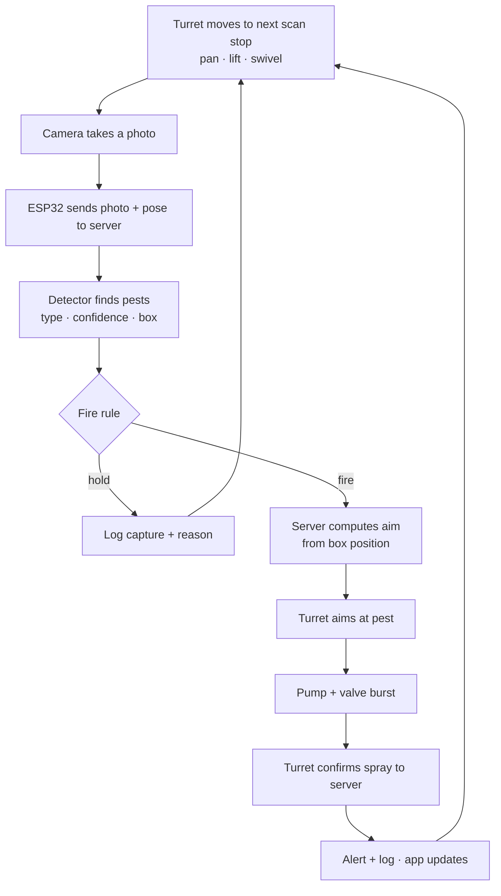
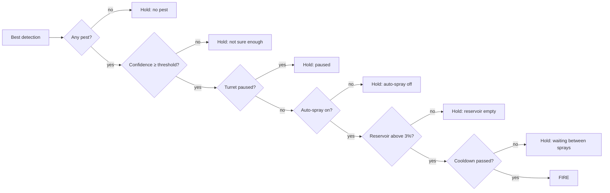
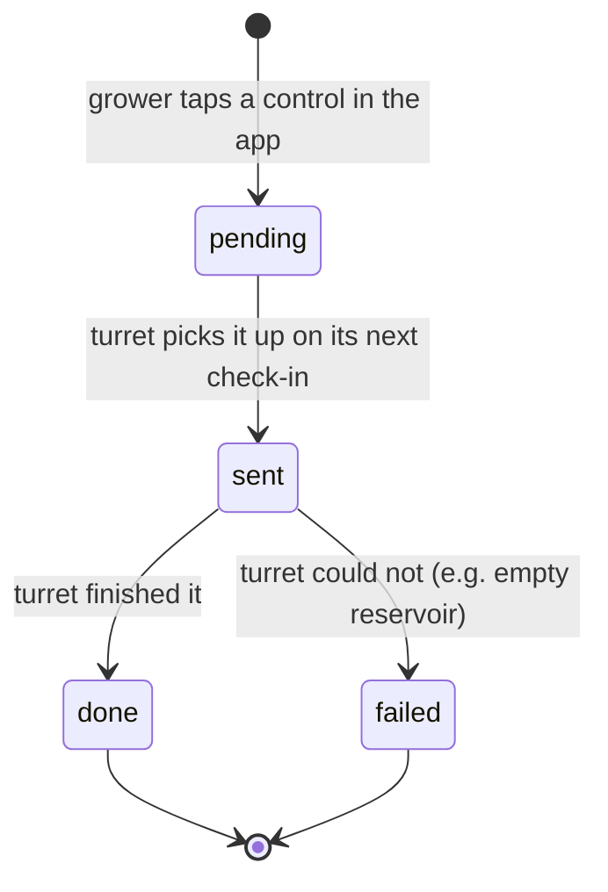
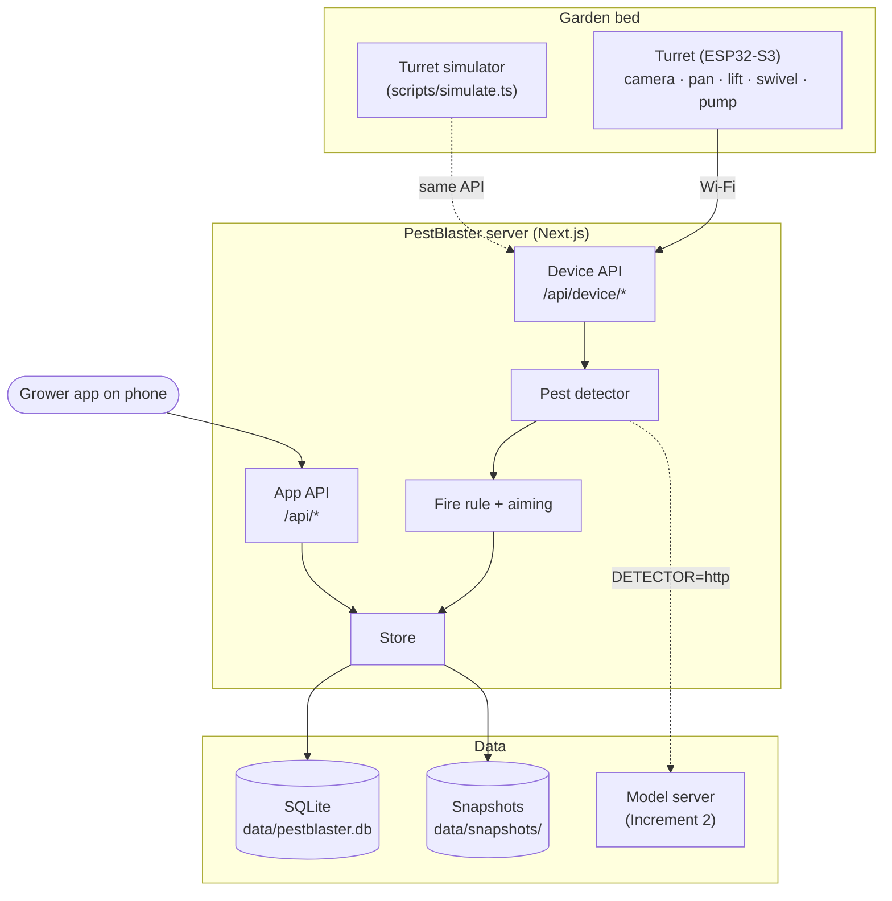
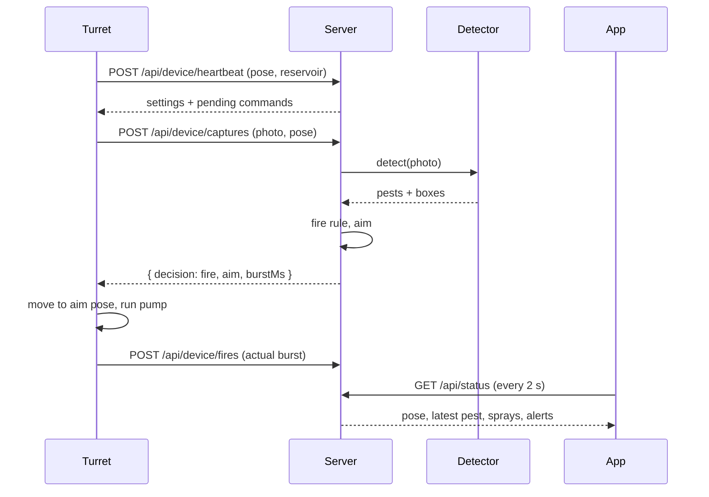
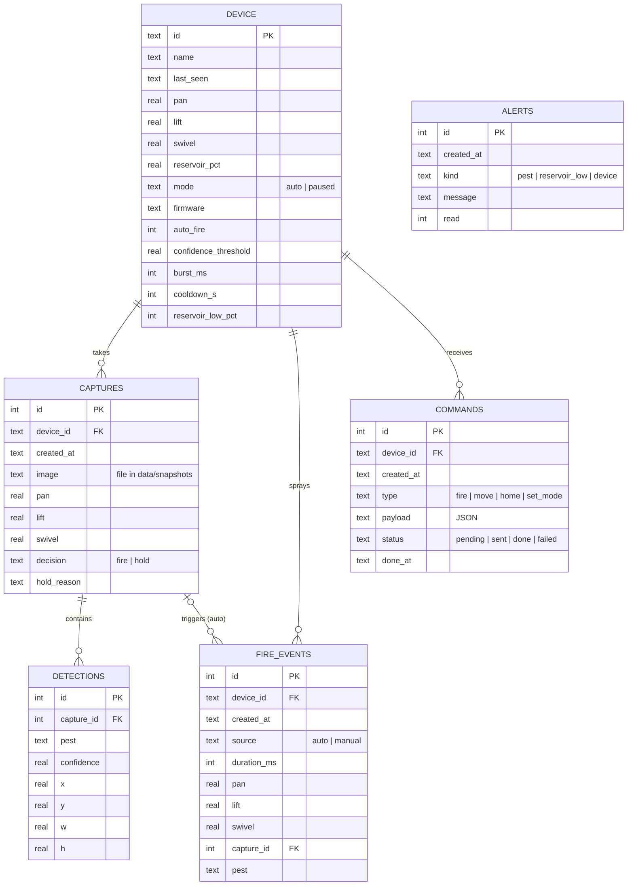

# PestBlaster — Project Documentation

> **Status:** v0.1 — Increment 1 (software) implemented and tested on the development branch. Hardware not yet built.
> Anything marked *(planned)* describes the intended design from the *PestBlaster Project Design Proposal* (CpE, Cebu Institute of Technology – University, September 2026) and is not built yet.
> Diagrams are written in [Mermaid](https://mermaid.js.org/) and render directly on GitHub.

## Table of Contents
1. [Feature Information](#1-feature-information)
2. [Project Information](#2-project-information)
3. [Overview](#3-overview)
4. [System Flow](#4-system-flow)
5. [User Interface & Features Breakdown](#5-user-interface--features-breakdown)
6. [Core Concepts](#6-core-concepts)
7. [System Architecture](#7-system-architecture)
8. [Design System](#8-design-system)
9. [Data Model](#9-data-model)
10. [API Endpoints](#10-api-endpoints)
11. [Hardware Summary](#11-hardware-summary)
12. [Frontend Architecture](#12-frontend-architecture)
13. [Backend Implementation](#13-backend-implementation)
14. [Setup & Configuration](#14-setup--configuration)
15. [Common Tasks](#15-common-tasks)
16. [Known Issues, Caveats & Open Questions](#16-known-issues-caveats--open-questions)
17. [Quick Reference for the Next Developer](#17-quick-reference-for-the-next-developer)
18. [Appendix A — Increment Plan](#appendix-a--increment-plan)
19. [Appendix B — Testing Strategies](#appendix-b--testing-strategies)
20. [Appendix C — Pest Detection Model Plan](#appendix-c--pest-detection-model-plan)
21. [Appendix D — Documentation Checklist](#appendix-d--documentation-checklist)

---

## 1. Feature Information

| Field | Value |
|-------|-------|
| **Project** | PestBlaster: Design and Development of an Autonomous Rotating Turret System for Detection and Organic Deterrence of Leaf-Feeding Pests in Lettuce Crops |
| **Type** | Embedded turret (ESP32-S3) + backend server + mobile-first grower app |
| **Status** | Increment 1 (software) built and tested; hardware and trained model pending |
| **Degree / Course** | BS Computer Engineering, Project Design (CpE 481) |
| **School** | Cebu Institute of Technology – University |
| **Adviser** | Engr. Nikko D. Alferez |
| **Primary users** | Growers in school and community lettuce gardens |
| **Target pests** | Diamondback moth larvae, loopers, aphid clusters |
| **Frontend + API** | Next.js 15 (App Router), React 19, TypeScript |
| **Database** | SQLite (built into Node.js 22) — file in `data/` |
| **Pest detection** | Pluggable: simulated stand-in (Increment 1) → trained model served over HTTP *(planned, Increment 2)* |
| **Turret controller** | ESP32-S3 with OV5640 camera *(planned)*; a software simulator plays its part today |
| **Architecture style** | Modular monolith server + thin device client |
| **Key flow** | Turret scans → sends photo → server detects pest → server decides fire or hold and where to aim → turret aims and sprays → app shows it all |

---

## 2. Project Information

### Repository
| Field | Value |
|-------|-------|
| **Repository** | [github.com/helidastar/PestBlaster](https://github.com/helidastar/PestBlaster) |
| **Default branch** | `main` |
| **Documentation** | `docs/DOCUMENTATION.md` (this file) |

### Branches
| Branch | Purpose | Status |
|--------|---------|--------|
| `main` | Stable, reviewed work and project documentation. | Exists |
| `development` | Backup of `main` taken just before each increment is merged, so the last checked version can always be restored. Not worked on directly. | Exists |

| Tag | Points to |
|-----|-----------|
| `before-increment-1` | `main` before Increment 1 (initial commit) |
| `feat/increment-1` | Increment 1 software and this documentation | Exists |
| `feat/firmware` *(suggested)* | ESP32-S3 firmware (Increment 2–3) | Suggested |
| `feat/model` *(suggested)* | Dataset scripts, training notebooks and the model server (Increment 2) | Suggested |

**Branch naming:** `feat/<area>` for features, `fix/<area>` for fixes.

**Commit messages:** one line, `type(area): what changed`, for example `feat(ui): add spray history tab`. Types: `feat`, `fix`, `docs`, `test`, `chore`, `refactor`.

**Branch flow:** `feat/* → main` (via pull requests).

**Before merging an increment into `main`:** update the backup first so it holds the version that was already checked.

```bash
git fetch origin
git push origin origin/main:development
git tag -a before-increment-N origin/main -m "main before increment N"
git push origin before-increment-N
```

The `development` branch holds only the latest backup; the `before-increment-N` tags keep every one. To see a past version: `git checkout before-increment-1`.

To restore the backup: `git checkout -b fix/restore origin/development`, then open a pull request into `main`.

### Contributors
| Name | GitHub |
|------|--------|
| Adriyanna G. Diana | — |
| Maria Mhikyla L. Jayno | [@mhiksNmatch](https://github.com/mhiksNmatch) |
| Charity T. Ricabo | [@helidastar](https://github.com/helidastar) |

**Adviser:** Engr. Nikko D. Alferez

### Milestones (to date)
| Date | Milestone |
|------|-----------|
| 2026-09-19 | Title defense. Panel asked for: lettuce/leafy crops instead of round cabbage, full 360° turret rotation, automatic up–down movement. |
| 2026-09-24 | Approval sheet submitted |
| 2026-09-26 | Increment 1 software (backend, app, simulator) pushed |

---

## 3. Overview

### 3.1 Problem statement
Lettuce is a common vegetable crop in Cebu, but it is highly vulnerable to leaf-feeding pests such as diamondback moth larvae, loopers and aphids. They feed directly on the leaves and, left unchecked, cause skeletonized leaves, stunted growth and significant yield loss. Existing smart garden systems only **monitor and alert** — they take no physical action. In gardens without constant supervision, larvae keep feeding in the time between an alert and someone responding. There is no low-cost, autonomous system that detects these pests on lettuce and **immediately responds with a physical deterrent**.

### 3.2 Goals
**General objective:** design and develop PestBlaster, an autonomous pest detection and deterrence turret that protects lettuce crops by detecting leaf-feeding pests and immediately dispersing an organic deterrent.

**Specific objectives**
1. A machine vision pipeline that detects and classifies diamondback moth larvae, loopers and aphid clusters.
2. A stepper-driven 360° rotating turret with a telescoping post and a hanging swivel camera mount that can aim anywhere on the plant, including leaf undersides, from the top down to soil level.
3. A valve/pump control system that releases timed organic deterrent bursts once a pest is confirmed.
4. A companion mobile app to monitor pest activity, view detection logs and manage the system remotely.
5. An evaluation of detection accuracy, response time and reduction in leaf damage against a monitoring-only baseline.

### 3.3 Success looks like
- A pest is sprayed **within seconds** of being photographed, with no one present.
- A grower opens the app and can tell at a glance: is the turret online, where is it looking, what did it find, did it spray, is the bottle running low.
- The grower can **stop or take over** the turret at any time (harvesting, refilling, maintenance).

### 3.4 Stakeholders
| Stakeholder | Interest / role | What they need from the system |
|-------------|-----------------|--------------------------------|
| School garden teachers and students | Grow lettuce with less supervision | Less chemical exposure, fewer hours watching the bed |
| Community garden growers | Protect a small plot cheaply | Low cost, no special pest knowledge needed |
| Development team | Build and test the system | Clear increments, testable software before hardware exists |
| Adviser and panel | Evaluate the project | Working increments, measured accuracy and response time |

### 3.5 Project functions → where they live
| # | Function (from proposal) | Increment 1 status | Where |
|---|--------------------------|--------------------|-------|
| 1 | Pest detection | Pipeline built; simulated detector, HTTP model hook ready | `src/lib/detector/` |
| 2 | Target tracking (pan, lift, swivel) | Aim math and scan path built and tested; simulated turret | `src/lib/targeting.ts`, `src/lib/scan.ts` |
| 3 | Automated deterrent firing | Fire/hold rule built and tested; simulated spray | `src/lib/decision.ts` |
| 4 | Remote monitoring | Built | App: Turret and Pests screens |
| 5 | Alert notifications | In-app alerts built (pest found, refill needed); phone push *(planned)* | `src/lib/store.ts`, History → Alerts |
| 6 | Manual override | Built (spray now, move, return home, pause, auto-spray off) | App: Control screen |
| 7 | Data logging | Built (every capture, detection, spray, command) | SQLite, History → Trends |

### 3.6 Scope & limitations
**Scope:** lettuce in small to medium plots (school and community gardens); three target pests; organic, non-toxic botanical spray; one raised bed or row per turret; the app covers monitoring, alerts and manual override (no marketplace or yield prediction).

**Limitations (from the proposal):**
- The deterrent repels, it does not kill; it is not a substitute for full integrated pest management.
- Accuracy may drop for small green pests like loopers that blend into the leaf, under overlapping leaves, in poor light, rain or wind.
- Two coordinated rotating mechanisms (pan base + swivel mount) add control complexity; the swivel wiring is subject to flex fatigue.
- The 0.5 m arm may sway in wind, affecting fine aim.
- The telescoping post has 30 cm of travel, which may not cover taller plants.
- IR/thermal night detection is a stretch feature.
- Not rated for extreme weather. The reservoir needs manual refilling.

---

## 4. System Flow

### 4.1 Scan–detect–aim–spray loop



### 4.2 Fire rule (checked in this order)



### 4.3 Manual command lifecycle



The app shows these as **Waiting for turret → Turret is doing it → Done / Turret could not do it**.

---

## 5. User Interface & Features Breakdown

A mobile-first web app. It can be added to the phone's home screen (web app manifest). Four tabs along the bottom.

| Screen | Contents |
|--------|----------|
| **Turret** (home) | Online/offline status · auto-spray on/off · **turret map** (top-down view: arm shows pan angle, rings show height from soil to top, shapes show recent pest sightings, a ripple marks the latest spray) · lift gauge · pan/lift/swivel readout · auto-spray switch · reservoir bottle level · today's counts (spots checked, pests seen, sprays) · latest pest photo with what the turret did |
| **Pests** | Every photo with a pest, newest first, with detector boxes and confidence · filter by pest · shows whether it was sprayed or why not · pose and leaf top / under leaf |
| **Control** | Pause / resume turret · **Spray now** · aim by hand (pan, lift, swivel sliders → Move turret, Return home) · spray settings (confidence threshold, spray length, wait between sprays, low-bottle warning) · recent commands with progress |
| **History** | Trends: stacked bars of pests per day for 7 days, with hover details and a table view · Sprays: every spray (auto or manual) with pest and pose · Alerts: pest found, refill needed (unread badge on the tab) |

Design priorities: readable outdoors on a phone, large touch targets, plain language ("Spray now", not "Trigger actuator"), and every hold reason spelled out so the grower knows why it did not spray.

---

## 6. Core Concepts

### 6.1 Pest types
| Code | Name | Scientific name | Notes for the model |
|------|------|-----------------|---------------------|
| `diamondback_larva` | Diamondback moth larva | *Plutella xylostella* | Small, pale green; windowpane holes |
| `looper` | Looper | *Trichoplusia ni* | Green, arches its body; blends into the leaf (hardest class) |
| `aphid_cluster` | Aphid cluster | Aphididae | Groups of tiny insects, mostly on leaf undersides |

### 6.2 Turret pose (the coordinate system)
| Axis | Range | Meaning |
|------|-------|---------|
| **Pan** | 0–360° | Base rotation, 0° = reference direction, clockwise |
| **Lift** | 0–300 mm | Telescoping post travel. 0 = lowest (soil level), 300 = highest |
| **Swivel** | −170° to +170° | Camera + nozzle angle. 0° = level, 90° = straight down, above 90° = swung back to look under the leaf |

The nozzle is mounted beside the camera, so aiming the camera at a pest also aims the spray.

### 6.3 Scan path
One sweep = 12 pan stops (every 30°) × 3 heights (300, 150, 0 mm) × 2 camera angles (60° leaf top, 130° under leaf) = **72 photos**. The lift direction alternates between pan stops (top→soil, then soil→top) so the post never makes an empty return trip. Defined in `src/lib/scan.ts`.

### 6.4 Aiming
The detector returns a box in image coordinates (0–1). The server converts the box center into angle corrections using the camera's field of view (OV5640 ≈ 68° × 52°, pinhole model):

- Box right of center → **pan** right; box below center → **swivel** down.
- If the swivel would pass ±170°, the remaining angle is covered by moving the **lift** instead (using the ~150 mm working distance).
- Lift is always clamped to 0–300 mm.

### 6.5 Default settings (changeable in the app)
| Setting | Default | Range | Why |
|---------|---------|-------|-----|
| Confidence threshold | 60% | 10–99% | Below this the turret logs but does not spray |
| Spray length | 400 ms | 100–3000 ms | R385 pump ≈ 2 L/min → ≈ 13 mL per burst |
| Wait between sprays | 10 s | 0–600 s | Lets the deterrent work; saves liquid |
| Low-bottle warning | 20% | 5–80% | Alert once when the level crosses it |
| Reservoir empty | 3% (fixed) | — | Pump must not run dry |

### 6.6 Alerts
| Alert | When | Repeat protection |
|-------|------|-------------------|
| Pest found | A confident pest is seen (sprayed, or held because paused / auto-spray off / cooldown / empty) | At most one per pest type every 5 minutes |
| Refill needed | Reservoir drops below the warning level | Once per crossing (not again until refilled above it) |

### 6.7 Online / offline
The turret checks in every few seconds. If the server has not heard from it for **30 seconds**, the app shows it as offline. Commands sent while offline wait until it reconnects.

---

## 7. System Architecture

### 7.1 Architecture style
A **modular monolith** server (one Next.js app for API + grower app) and a **thin device client** (the ESP32). The ESP32 only moves, photographs, sprays and reports; all detection and decisions happen on the server. This follows the "ESP32 plus cloud detection (most practical)" option in the proposal: the ESP32-S3 does not have the memory for an accurate three-pest model, while a laptop or server does. The few seconds of delay are fine because these pests move slowly.

### 7.2 High-level architecture



### 7.3 Capture sequence



### 7.4 Deployment
| Setup | When | Notes |
|-------|------|-------|
| Laptop on the garden Wi-Fi | Increment 1–3 demos and testing | `npm run build && npm start`. Phone and ESP32 connect to `http://<laptop-ip>:3000` |
| Small always-on machine (Raspberry Pi / mini PC / VPS) | Field testing | Same app; SQLite file persists on disk |

Serverless hosts (e.g. Vercel) are **not** suitable while the database is a local SQLite file, because their disk is not persistent.

### 7.5 Key design decisions
| Decision | Why |
|----------|-----|
| Detection on the server, not the ESP32 | Accurate models need more memory than the ESP32-S3 has; server models can be retrained and swapped without reflashing |
| Server decides fire/aim, ESP32 obeys | One place for the rule; settings change instantly from the app; firmware stays small |
| Turret confirms each spray | Spray log reflects what really happened, not what was requested |
| Commands delivered on heartbeat | ESP32 only makes outgoing requests; works behind any home router, no open ports |
| SQLite built into Node 22 | Zero setup, no accounts, one file to back up; enough for one turret |
| Simulator uses the real device API | Everything tested with the simulator is what the firmware will use |

---

## 8. Design System

### 8.1 Colors
| Token | Light | Dark | Use |
|-------|-------|------|-----|
| `--bg` | `#eef2e2` | `#16130f` | Page (butterhead leaf / night soil) |
| `--surface` | `#f8faf1` | `#211c16` | Cards |
| `--ink` | `#1f1a14` | `#e8eeda` | Text (soil) |
| `--leaf` | `#3d6b2a` | `#8fc46a` | Primary actions, "on" states |
| `--spray` | `#1a7488` | `#4fb3c6` | Anything to do with spraying / deterrent |
| `--danger` | `#b42318` | `#f07a6a` | Offline, refill needed |
| `--pest-dbm` | `#b07a12` | `#b8862a` | Diamondback moth larva |
| `--pest-looper` | `#7b4fb8` | `#9474dc` | Looper |
| `--pest-aphid` | `#c8406e` | `#db5f87` | Aphid cluster |

The three pest colors were checked with a colorblind-safety validator in both light and dark mode. Each pest also has its own **shape** (larva ●, looper ■, aphids ▲), so identity never depends on color alone.

### 8.2 Typography & layout
- **Familjen Grotesk** for headings, **Atkinson Hyperlegible** for body text (designed for legibility, useful outdoors in sunlight), **JetBrains Mono** for angles and readings.
- Single column, max 720 px, 16 px side gutter; bottom tab bar for one-thumb use.
- Respects dark mode and reduced-motion settings; visible keyboard focus.

### 8.3 Reusable components
`Radar` (turret map), `Reservoir` (bottle level), `Snapshot` (photo + detection boxes), `PestShape` / `PestLabel`, `TrendChart`, `Nav`.

---

## 9. Data Model

### 9.1 Entity relationship diagram



### 9.2 Tables
| Table | Purpose |
|-------|---------|
| `device` | One row per turret: last known pose, reservoir level, mode and spray settings. `turret-1` is created automatically. |
| `captures` | Every photo the turret sent, its pose, and the fire/hold decision with the reason. |
| `detections` | Pests found in a capture (type, confidence, box). |
| `fire_events` | Every spray the turret confirmed, auto or manual. |
| `commands` | Manual override queue from the app to the turret. |
| `alerts` | Messages shown to the grower. |

Timestamps are stored in UTC (ISO 8601). Daily trends are grouped by Philippine local day (UTC+8). Photos are saved only when at least one pest was detected, so the disk does not fill with empty leaves.

---

## 10. API Endpoints

### 10.1 Device API (used by the ESP32 firmware and the simulator)
Every request must send the header `x-device-key: <DEVICE_API_KEY>`. Optional `x-device-id` (default `turret-1`).

| Method | Path | Body | Returns |
|--------|------|------|---------|
| POST | `/api/device/heartbeat` | `{ pose: {pan, lift, swivel}, reservoirPct, firmware? }` | `{ mode, settings, commands[] }` — commands are now marked `sent` |
| POST | `/api/device/captures` | multipart: `image` (JPEG/PNG), `pose` (JSON string) | `{ captureId, detections[], decision }` |
| POST | `/api/device/fires` | `{ source: "auto"\|"manual", durationMs, pose, captureId? }` | the stored spray (201) |
| POST | `/api/device/commands/{id}` | `{ ok: true\|false }` | the updated command |

`decision` is either `{ "action": "fire", "target": {...}, "aim": {pan, lift, swivel}, "burstMs": 400 }` or `{ "action": "hold", "reason": "cooldown", "target": {...} }`.

Firmware loop *(planned)*: heartbeat → run any commands → move to next scan stop → capture → if `fire`, move to `aim`, run pump for `burstMs`, POST the spray, return to the scan stop → repeat.

### 10.2 App API
| Method | Path | Purpose |
|--------|------|---------|
| GET | `/api/status` | Everything for the home screen: device, online, today's counts, latest pest, last spray, recent commands, unread alerts |
| GET | `/api/captures?pest=&limit=` | Captures that contain pests, newest first |
| GET | `/api/fires?limit=` | Spray history |
| GET | `/api/stats?days=7` | Pests per type and sprays per day |
| GET / POST | `/api/alerts` | List alerts / mark all as read |
| PATCH | `/api/settings` | Change `autoFire`, `mode`, `confidenceThreshold`, `burstMs`, `cooldownS`, `reservoirLowPct` |
| GET / POST | `/api/commands` | List / queue `{type: "fire", durationMs}`, `{type: "move", pose}`, `{type: "home"}` |
| GET | `/api/snapshots/{file}` | A stored photo |

### 10.3 Example capture response
Turret at pan 90°, lift 150 mm, swivel 60° sees a larva right of and slightly above the image center:

```json
{
  "captureId": 128,
  "detections": [
    { "pest": "diamondback_larva", "confidence": 0.86,
      "bbox": { "x": 0.61, "y": 0.42, "w": 0.09, "h": 0.05 } }
  ],
  "decision": {
    "action": "fire",
    "target": { "pest": "diamondback_larva", "confidence": 0.86, "bbox": { "x": 0.61, "y": 0.42, "w": 0.09, "h": 0.05 } },
    "aim": { "pan": 101.8, "lift": 150, "swivel": 56.9 },
    "burstMs": 400
  }
}
```

---

## 11. Hardware Summary

*(planned — from the proposal and the draft bill of materials; final parts to be confirmed with the adviser)*

| Subsystem | Parts |
|-----------|-------|
| Controller & vision | ESP32-S3 with 8 MB PSRAM (e.g. ESP32-S3-DevKitC-1 N16R8 or Freenove ESP32-S3-WROOM CAM) · OV5640 5 MP camera, no-IR-filter lens · 850 nm IR LED ring · microSD for buffering photos when Wi-Fi drops |
| 360° pan | Stepper motor (proposal) or continuous-rotation servo (draft BOM) · 12-wire capsule slip ring · rotary water union for the hose |
| Lift | Motor + threaded rod in a 1¼″/1″ telescoping PVC post (30 cm travel) · 2 × limit switches (top, bottom) |
| Swivel | MG996R metal-gear servo (±170° hanging mount) · MG90S head tilt |
| Deterrent | R385 12 V diaphragm pump · 12 V normally-closed ¼″ solenoid valve · 2-channel relay or MOSFET module · 6 mm tubing · 0.3–0.5 mm brass misting nozzle · recycled 2–3 L HDPE bottle · neem oil, garlic–chili mix, or Bt |
| Power | 12 V 7 Ah SLA battery · 10–20 W solar panel + PWM charge controller (or 12 V 3 A adapter) · buck converters for 5 V logic and servos · inline fuse and switch |
| Structure | 500 × 500 mm pallet-wood base with brick weights · 0.5 m PVC arm with internal metal rod · sand-filled end cap counterweight · IP65 enclosure with cable glands and silica gel |

---

## 12. Frontend Architecture

### 12.1 Folder structure

```
src/
  app/
    layout.tsx            shell, fonts, bottom nav
    page.tsx              Turret (home)
    pests/page.tsx        Pests seen
    control/page.tsx      Manual control + settings
    history/page.tsx      Trends, sprays, alerts
    manifest.ts           add-to-home-screen
    globals.css           design tokens + all styles
    api/                  route handlers (section 10)
  components/             Radar, Reservoir, Snapshot, PestMark, TrendChart, Nav, Icons
  lib/
    client.ts             usePoll hook, fetch helper, time formatting
    view-types.ts         response shapes used by pages
```

### 12.2 Data fetching
Pages are client components that poll the API (`usePoll`): the Turret and Control screens every 2 s, other lists every 4–10 s. Polling pauses while the browser tab is hidden. No login yet (see section 16).

### 12.3 Styling
Plain CSS with design tokens in `globals.css` (no CSS framework). Light and dark themes follow the phone's setting.

---

## 13. Backend Implementation

### 13.1 Modules (`src/lib/`)
| File | Responsibility |
|------|----------------|
| `pests.ts` | The three pest types, labels, colors |
| `types.ts` | Shared types: `Pose`, `Detection`, `Decision`, `DeviceSettings`, … |
| `targeting.ts` | Mechanical limits, camera field of view, `aimAt()`, `isAimed()` |
| `scan.ts` | `scanWaypoints()` — the 72-stop sweep |
| `decision.ts` | `decide()` — the fire rule; `HOLD_REASON_TEXT` for the app |
| `detector/` | `getDetector()` picks the detector from `DETECTOR` |
| `db.ts` | Opens SQLite, creates tables, creates `turret-1` |
| `store.ts` | All reads and writes; alert rules; daily stats |
| `api.ts` | Device-key check, input validation, error handling |

### 13.2 Detectors
| `DETECTOR` | What it does | Use |
|------------|--------------|-----|
| `simulated` (default) | Reads the ground truth that the simulator drew into its photo and adds realistic mistakes: 8% missed pests, ±0.12 confidence noise, small box shifts. Returns nothing for a real camera photo. | Increment 1: test everything around the model |
| `http` | POSTs the photo bytes to `DETECTOR_URL` and expects `{ "detections": [ { "pest", "confidence", "bbox": {x, y, w, h} } ] }` with box values as fractions of the image. Unknown pests and bad boxes are dropped. | Increment 2: the trained model (see Appendix C) |

To add another detector, implement the `Detector` interface in `src/lib/detector/types.ts` and add a case in `detector/index.ts`.

### 13.3 Turret simulator (`scripts/simulate.ts`)
Plays the ESP32 using the real device API. It follows the scan path, draws a synthetic lettuce leaf (top or underside) with random pests, uploads it, aims and "sprays" when told, uses up deterrent (≈1.3% of the bottle per spray-second), and runs manual commands from the app.

| Option | Default | Meaning |
|--------|---------|---------|
| `--url` | `http://localhost:3000` | Server address |
| `--step` | `1500` | Milliseconds between scan stops |
| `--pest-rate` | `0.3` | Chance a photo contains a pest |
| `--reservoir` | `100` | Starting bottle level (%) — use `25` to demo the refill alert |
| `--once` | off | One full sweep, then stop |

### 13.4 Tests (`tests/`)
32 unit tests (Vitest): aiming and limits, the fire rule and every hold reason, scan coverage, both detectors, and the store (alerts, commands, stats) against an in-memory database. Run `npm test`.

---

## 14. Setup & Configuration

### 14.1 Prerequisites
- **Node.js 22.13 or newer** (SQLite is built in; check with `node -v`)
- Git

### 14.2 Environment variables (`.env.local`, optional)
Copy `.env.example` to `.env.local`.

| Variable | Default | Purpose |
|----------|---------|---------|
| `DEVICE_API_KEY` | `pestblaster-dev` | Shared secret the turret sends. **Change it** before putting the server on a real network. |
| `PESTBLASTER_DATA_DIR` | `./data` | Where the database and photos go |
| `DETECTOR` | `simulated` | `simulated` or `http` |
| `DETECTOR_URL` | — | Model server URL when `DETECTOR=http` |

### 14.3 Running

```bash
git clone https://github.com/helidastar/PestBlaster.git
cd PestBlaster
npm install
npm run dev                  # terminal 1: app + API at http://localhost:3000
npm run simulate             # terminal 2: pretend turret
```

Open http://localhost:3000. To open it on a phone, connect the phone to the same Wi-Fi and go to `http://<laptop-ip>:3000` (find the IP with `ipconfig` on Windows or `ifconfig` / `ip addr` on macOS/Linux).

For a demo, use the production build (faster): `npm run build && npm start`.

### 14.4 Scripts
| Command | What it does |
|---------|--------------|
| `npm run dev` | Development server (reloads on save) |
| `npm run build` / `npm start` | Production build / run it |
| `npm run simulate` | Turret simulator (section 13.3) |
| `npm run reset-data` | Delete the database and photos (stop the server first) |
| `npm test` | Unit tests |
| `npm run typecheck` | TypeScript check |

---

## 15. Common Tasks

### 15.1 Run the Increment 1 demo
1. `npm run reset-data`, then `npm run build && npm start`.
2. In a second terminal: `npm run simulate -- --reservoir 30`.
3. On a phone, open the app. Show: the turret map moving, pests appearing, sprays, the bottle level dropping and the **Refill needed** alert.
4. Control → **Spray now**: watch the command go Waiting → Doing → Done and the spray appear in History.
5. Turn **Auto-spray** off: pests are still logged, with "Auto-spray is off" as the reason.
6. Stop the simulator: after 30 s the app shows **Offline**.

### 15.2 Change a default setting
Defaults for a new database are in the `device` table definition in `src/lib/db.ts`. Existing installs change them from the Control screen.

### 15.3 Change the scan path
Edit `DEFAULT_SCAN` in `src/lib/scan.ts` (pan step, heights, camera angles) and update `tests/scan.test.ts`.

### 15.4 Change camera field of view or mechanical limits
Edit `CAMERA` and `LIMITS` in `src/lib/targeting.ts` once the real camera lens and post are measured.

### 15.5 Switch to the real model
Start the model server (Appendix C), then set `DETECTOR=http` and `DETECTOR_URL=...` in `.env.local` and restart.

### 15.6 Add a pest type
Add it to `PEST_TYPES` and `PESTS` in `src/lib/pests.ts`, add a color token and shape (`src/components/PestMark.tsx`), and add its column in `dailyStats()` in `src/lib/store.ts`.

---

## 16. Known Issues, Caveats & Open Questions

### 16.1 Open questions (to settle with the adviser)
1. **Controller:** the proposal names the ESP32-S3; the draft BOM also lists Raspberry Pi 4 and ESP32-CAM options. This software assumes **ESP32-S3 + server-side detection**.
2. **Pan drive:** stepper motor (proposal) or continuous-rotation servo (draft BOM)? A continuous servo has no position feedback, so the firmware cannot know its true pan angle without an encoder or a home switch.
3. **Reservoir level:** no level sensor is in the BOM. Options: estimate from pump run time (what the simulator does), a float switch, or an ultrasonic/capacitive level sensor.
4. **Hose over 360°:** rotary water union, or limit pan to about ±180° with hose slack?
5. **Where the server runs** during field testing (laptop, Raspberry Pi, or a hosted machine).
6. **Approval sheet increments:** Appendix A is a proposed split for the adviser to confirm.

### 16.2 Risk register
| Risk | Impact | Mitigation |
|------|--------|------------|
| Not enough lettuce pest photos to train a good model | Low accuracy | Start collecting now; combine public datasets with our own photos (Appendix C) |
| Loopers blend into leaves | Missed pests | Separate accuracy per pest; tune threshold per pest if needed |
| Wi-Fi drops in the garden | Turret cannot get decisions | Buffer photos to microSD; firmware holds (never sprays blind) when offline |
| Wrong spray on a leaf with no pest | Wasted deterrent | Confidence threshold + cooldown, both adjustable in the app |
| Arm sway in wind | Misaimed spray | Re-capture after aiming before spraying *(planned firmware step)* |
| Swivel wiring fatigue | Camera loses connection | Strain relief, cycle testing (proposal) |

### 16.3 Technical caveats
- **No login yet.** Anyone on the same network can open the app and control the turret. Fine for demos on a private Wi-Fi; add accounts before any public deployment.
- The device key is one shared secret, sent in plain HTTP on the local network.
- Pest alerts appear inside the app only; phone push notifications are *(planned)*.
- Single turret (`turret-1`) in the app. The database and device API already accept other device IDs.
- Node prints an `ExperimentalWarning` for SQLite on start-up. It is harmless.
- Aim math assumes the nozzle points where the camera center points; the real offset must be measured and calibrated.

---

## 17. Quick Reference for the Next Developer

| Need to… | Go to |
|----------|-------|
| Understand the project | [Section 3](#3-overview) |
| See how data flows | [Section 7](#7-system-architecture) |
| Change the fire rule | `src/lib/decision.ts` |
| Change aiming / limits / camera FOV | `src/lib/targeting.ts` |
| Change the scan path | `src/lib/scan.ts` |
| Plug in the model | `src/lib/detector/`, `DETECTOR=http` |
| Change the database | `src/lib/db.ts` (schema) + `src/lib/store.ts` (queries) |
| Build the firmware | [Section 10.1](#101-device-api-used-by-the-esp32-firmware-and-the-simulator) — copy what `scripts/simulate.ts` does |
| Run everything | [Section 14.3](#143-running) |

**Rules of thumb**
1. The turret never sprays without a server `fire` decision or a manual command.
2. When in doubt, hold. Every hold has a reason the grower can read.
3. The simulator and the firmware use the same API. If you change the API, change both.
4. Same pest colors and shapes everywhere.
5. Run `npm test` and `npm run typecheck` before pushing.
6. Work on a `feat/*` branch → pull request into `main`.

---

## Appendix A — Increment Plan

*Proposed split for the approval sheet. Percentages follow the approval sheet template; functionalities are for the team and adviser to confirm.*

| Milestone | % | Functionalities included |
|-----------|---|--------------------------|
| **Increment 1** | 40% | **Software working end to end without hardware.** Backend server and database · device API for the turret · grower app (turret status and map, pest photos and logs, spray history, alerts, trends) · manual override (spray now, move, return home, pause, auto-spray off, spray settings) · fire rule and aiming logic with unit tests · 360° scan path · pluggable detector · turret simulator running the full scan → detect → aim → spray → log loop |
| **Increment 2** | 60% | Increment 1 plus **real detection and a talking ESP32.** Lettuce pest dataset collected and labeled · model trained and served (`DETECTOR=http`) · accuracy measured per pest · ESP32-S3 firmware: Wi-Fi, heartbeat, camera capture and upload, runs commands (bench test, motors not yet mounted) |
| **Increment 3** | 80% | Increment 2 plus **the physical turret.** 360° pan, telescoping lift with limit switches, swivel mount · pump + valve on relay with timed bursts · reservoir level measurement · firmware scan–detect–aim–spray loop on the real turret · aim calibration |
| **Increment 4** | 100% | Increment 3 plus **field-ready and evaluated.** Weatherproof enclosure and solar power · phone push notifications · night detection with IR (stretch) · field test on a lettuce bed · evaluation against a monitoring-only baseline (Appendix B) · final documentation |

---

## Appendix B — Testing Strategies

| # | Strategy | What we measure | How |
|---|----------|-----------------|-----|
| B.1 | Determining the detection accuracy per pest type | Precision, recall, F1 for each of the three pests; confusion between them | Held-out labeled test photos (Appendix C); later, photos from the real turret |
| B.2 | Determining the average response time from detection to spray | Seconds from photo taken to spray finished | Timestamps: capture `created_at` → fire event `created_at`; plus stopwatch on the physical turret |
| B.3 | Determining the aiming accuracy of the turret | Distance (mm) between nozzle hit point and the pest position | Paper targets on leaves at known positions; water-sensitive paper or dye in the spray |
| B.4 | Determining the coverage of the scan path | % of marked spots on the plant (top, middle, soil, leaf undersides) the camera sees in one sweep | Markers placed around a plant; count how many appear in captured photos |
| B.5 | Determining the reduction in leaf damage | % leaf area damaged, with PestBlaster vs. monitoring-only bed | Two beds over the same period; photograph and measure leaves weekly |
| B.6 | Determining the reliability of manual override | % of app commands completed and time to complete | Send N commands from the app; read status and timestamps from the command log |
| B.7 | Determining deterrent use per spray | mL per burst at each spray length | Collect sprays into a measuring cylinder |

B.2 and B.6 can already be run in software with the simulator in Increment 1.

---

## Appendix C — Pest Detection Model Plan

*(planned — Increment 2)*

### C.1 Approach
Train a small object detector (for example **YOLOv8n / YOLO11n**) on three classes: `diamondback_larva`, `looper`, `aphid_cluster`. Run it on the server behind a tiny HTTP service that follows the contract in section 13.2 (for example Python + FastAPI + Ultralytics). The Next.js server then only needs `DETECTOR=http`.

### C.2 Dataset
- Public pest image datasets (e.g. IP102, Roboflow Universe pest sets) for the three pests, filtered to leafy vegetables where possible.
- **Our own photos** of lettuce taken with the turret camera at 10–20 cm, leaf tops and undersides, different times of day. These matter most because they match what the turret will see.
- Negative photos (healthy leaves, soil, water drops, leaf damage without a pest) so the model learns not to spray those.
- Label with bounding boxes; split 70 / 20 / 10 (train / validation / test) by plant, not by photo, so near-duplicate photos do not leak into the test set.

### C.3 Acceptance
| Metric | Target (to confirm with adviser) |
|--------|----------------------------------|
| mAP@0.5 on the test set | ≥ 0.70 |
| Recall per pest | ≥ 0.75 (looper may be lower; report separately) |
| Server inference time per photo | < 1 s on the demo laptop |

The confidence threshold in the app is then set from the validation results (the point where false sprays are acceptably low).

---

## Appendix D — Documentation Checklist

| Item | Status |
|------|--------|
| Feature information, project information, contributors | Done |
| Overview, objectives, scope and limitations | Done |
| System flow and fire rule diagrams | Done |
| UI / features breakdown | Done |
| Core concepts (pose, scan path, aiming, settings, alerts) | Done |
| System architecture (Mermaid diagrams) | Done |
| Data model and APIs | Done |
| Frontend and backend architecture | Done |
| Setup, configuration and common tasks | Done |
| Known issues, open questions, risk register | Done |
| Increment plan and testing strategies | Proposed — confirm with adviser |
| Trained model and accuracy results | Pending (Increment 2) |
| Firmware | Pending (Increment 2–3) |
| Circuit design and prototype photos | Pending (Increment 3) |
